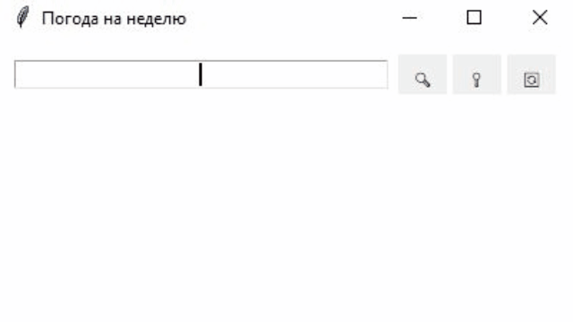

# Weather App

[](https://www.python.org/)
[](LICENSE)
[](https://world-weather.ru/)
[](https://2ip.io/)

Desktop weather application with a clean Tkinter GUI. Built with Python using HTML parsing of [world-weather.ru](https://world-weather.ru/) and automatic city detection via [2ip.io](https://2ip.io/).



## Installation

### Prerequisites
- Python 3.9 or higher
- `pip` package manager
- API token from [2ip.io](https://2ip.io/) (free registration)

### Steps

1. **Clone the repository**
   ```bash
   git clone https://github.com/M1shut3r/weather.git
   cd weather
   
1. **Configure environment variables**
   ```bash
      cp .env.example .env   
   ```
   Open .env and paste your 2ip.io token:

   ```bash
      API_TOKEN=your_2ip_token_here
   ```
1. **Install the package in editable mode**
   ```bash
      pip install -e .
      pip install -e ".[dev]"
   ```
   
### Usage
Launch the app from anywhere in your terminal:
   ```bash
      weather-app
   ```
Or run as a module:
   ```bash
      python -m weather
   ```

### Running Tests
```bash
   pytest tests/
```

### Project Structure

```json
weather/
├── src/weather/                  # Main package (src-layout)
│   ├── __init__.py
│   ├── __main__.py               # Entry point for `python -m weather`
│   ├── gui.py                    # Tkinter UI layer
│   ├── parser_html.py            # world-weather.ru parser + 2ip.io client
│   └── data/
│       └── http_headers.json     # HTTP headers for requests
├── tests/                        # Unit tests
│   └── test_parser.py
├── images/                       # App assets
│   └── image.gif
├── pyproject.toml                # Project metadata & dependencies
├── .env.example                  # Template for environment variables
├── .gitignore
└── README.md
```


